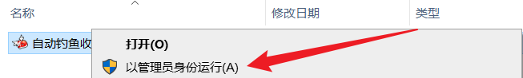
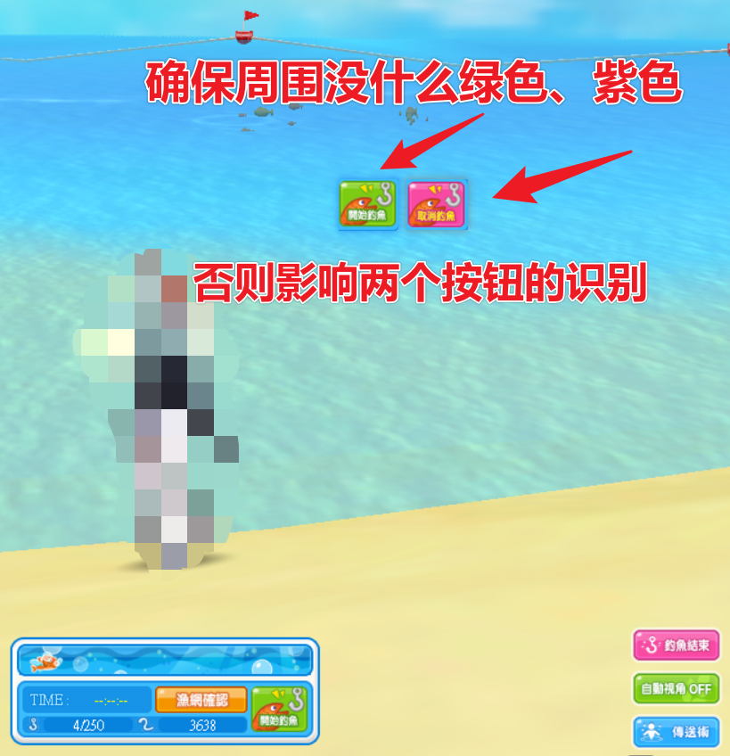
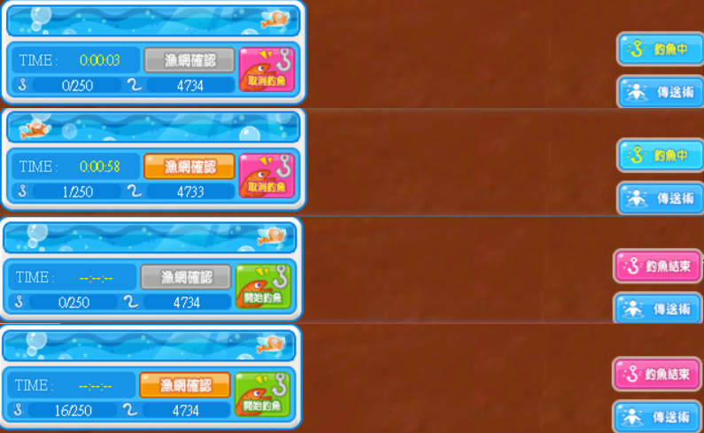
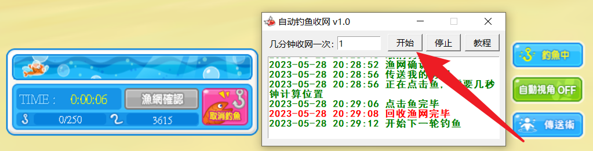
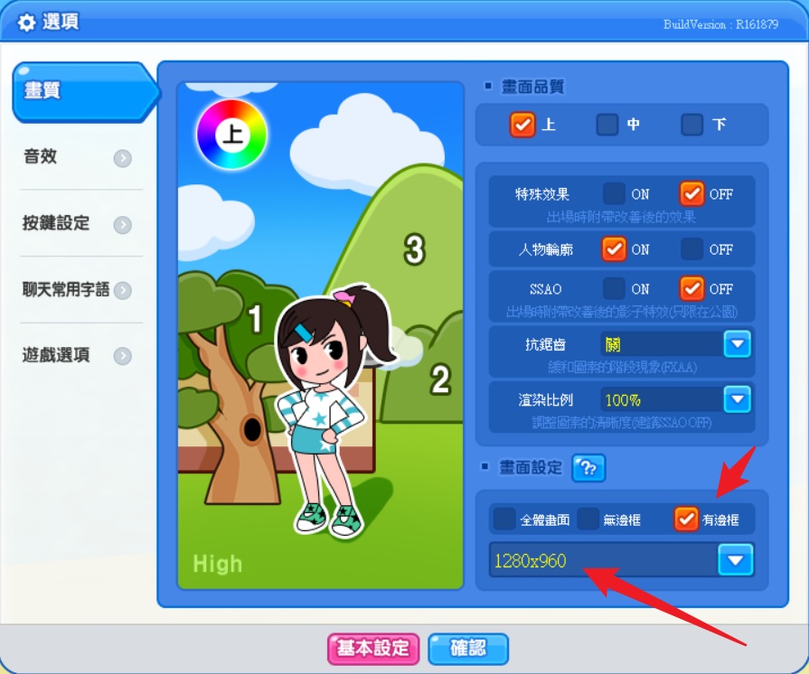
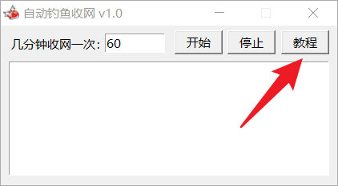
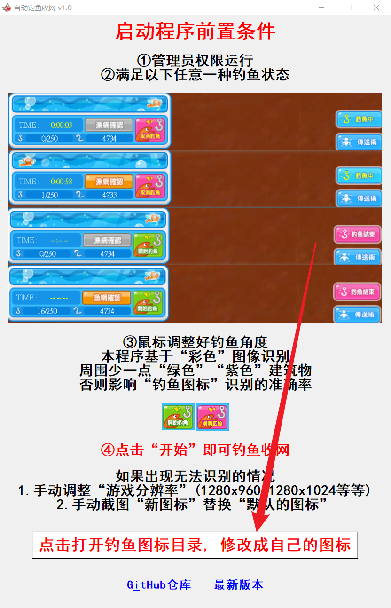
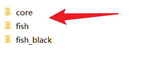
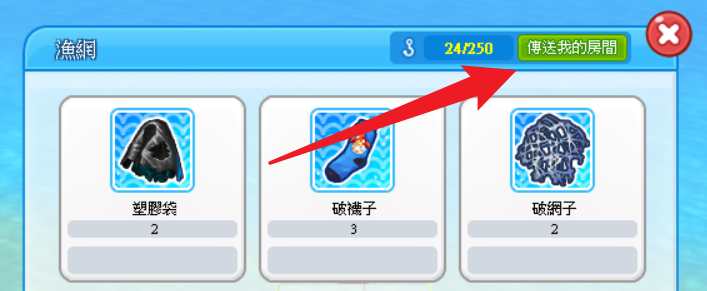
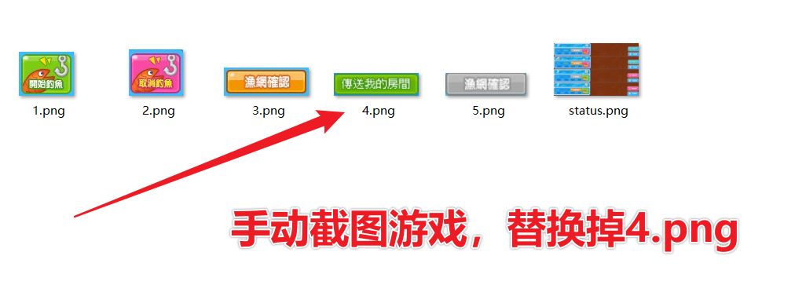

# 游戏启动流程

## 确保管理员运行

## 确保周围没什么绿色、紫色

## 四种状态都可以启动程序

## 启动程序

# 解决无法点击按钮的情况

## 调整游戏分辨率

- **「分辨率」和「钓鱼按钮」清晰度有关系**
- **我的素材是「低分辨率」，所以「默认图片可能点击失败」**
- **确保游戏窗口是「无边框」**

## 手动修改钓鱼按钮图标

### 进入教程

### 打开目录

### 图片目录

### 手动截图

### 替换截图

# 历史版本

## v1.0功能

- **几分钟收网一次**
- **开始和暂停程序**
- **自动尝试提升管理员权限「模拟键鼠」**
- **内置教程说明**
- **提供用户替换钓鱼按钮图片**

## v1.1功能

- **增加游戏窗口判断**